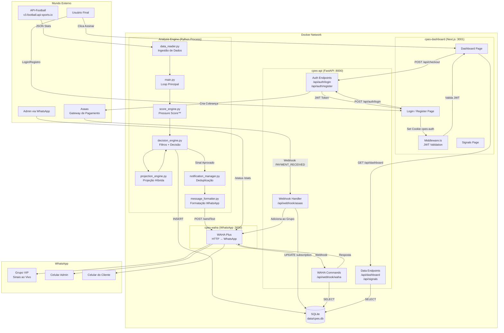
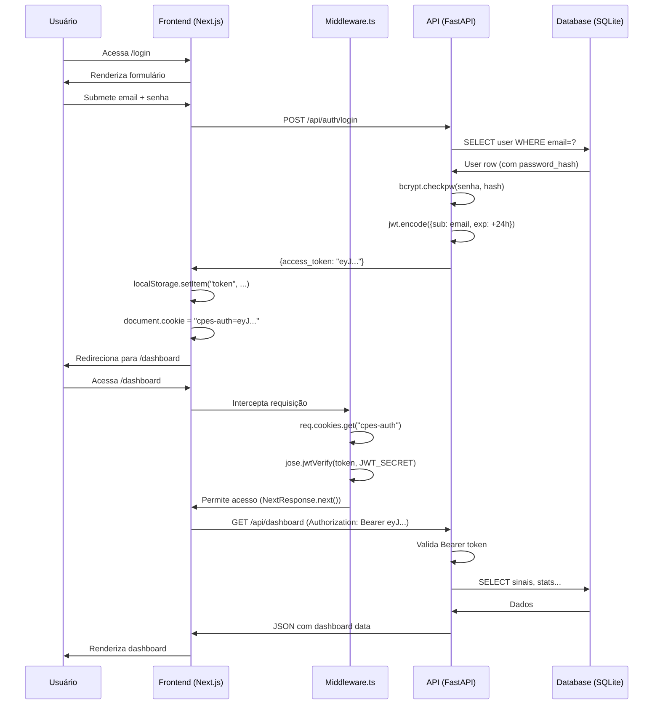
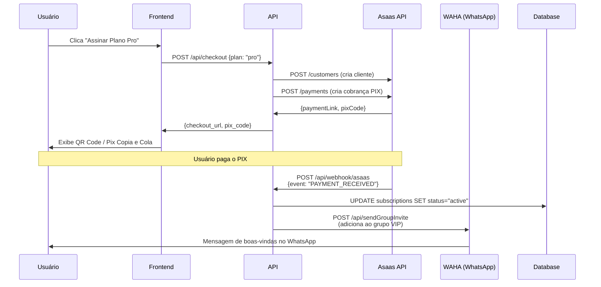

# PressureIQ — Análise Completa de Ponta a Ponta

> Documento de referência definitivo do sistema. Cobre visão executiva, estratégia de produto, marketing e arquitetura técnica profunda com detalhes de implementação.

---

# PARTE 1 — VISÃO EXECUTIVA

## O Que é o PressureIQ?

**PressureIQ** é uma plataforma SaaS B2C de inteligência esportiva para o mercado de apostas. O sistema monitora automaticamente centenas de partidas de futebol ao vivo, aplica um conjunto de algoritmos proprietários e entrega sinais de alta probabilidade diretamente no WhatsApp e em um dashboard web para os assinantes.

**Missão**: Transformar dados brutos de futebol em decisões de apostas matematicamente embasadas, eliminando o ruído e a emoção do processo.

## Modelo de Negócio

| Plano | Preço | Entregáveis |
|---|---|---|
| **Pro** | R$ 39,90/mês | Sinais de Escanteios + Dashboard |
| **Max** | R$ 89,90/mês | Escanteios + Cartões + Grupos VIP + Robô |

- **Receita Recorrente (MRR)**: Modelo de assinatura mensal via Asaas (PIX/Cartão).
- **Churn Barrier**: O valor percebido aumenta com o tempo (histórico de ROI pessoal).
- **CAC Baixo**: Automação total do onboarding (sem intervenção humana após a compra).

## Proposta de Valor

Para o apostador, o PressureIQ resolve três dores fundamentais:

1. **Tempo**: Monitorar 50 jogos ao mesmo tempo é impossível. O sistema faz isso 24h/dia.
2. **Emoção**: Apostadores perdem dinheiro por impulso. O algoritmo é frio e matemático.
3. **Informação**: Dados de pressão de jogo (ataques perigosos, ritmo de escanteios) não são visíveis nas casas de apostas. O PressureIQ os processa e entrega o resultado.

---

# PARTE 2 — ESTRATÉGIA DE MARKETING & PRODUTO

## Posicionamento

**"A Ciência por trás do Green."**

O PressureIQ não é um "grupo de tips". É uma **ferramenta profissional de análise**, posicionada como a Bloomberg Terminal do apostador esportivo. Isso justifica o preço premium e cria uma percepção de autoridade.

### Pilares da Marca
- **Precisão**: Dados reais, algoritmo auditável, ROI rastreado.
- **Exclusividade**: Acesso a informações que o apostador comum não tem.
- **Automação**: "Trabalha enquanto você dorme."

## Jornada do Cliente (Funil Completo)

```
[Tráfego] → [Landing Page] → [Cadastro Grátis] → [Ver Dashboard] → [Assinar] → [WhatsApp VIP] → [Renovar]
```

1. **Awareness**: Tráfego pago (Meta Ads, Google) ou orgânico (YouTube, TikTok com resultados).
2. **Consideração**: O usuário acessa `iqpressure.online`, vê o design premium e os resultados históricos.
3. **Ativação**: Cadastro gratuito. O usuário vê o dashboard mas não recebe sinais em tempo real.
4. **Conversão**: Tela de planos. O usuário escolhe Pro ou Max e paga via PIX.
5. **Retenção**: Recebe sinais no WhatsApp diariamente. Dashboard mostra o histórico de ROI pessoal.
6. **Expansão**: Upgrade de Pro para Max ao ver os resultados de Cartões.

## Diferenciais Competitivos

| Feature | PressureIQ | Grupos de Tips Comuns |
|---|---|---|
| Algoritmo proprietário | ✅ Pressure Score™ | ❌ Análise subjetiva |
| Dados ao vivo | ✅ API-Football | ❌ Olho humano |
| Onboarding automático | ✅ Webhook Asaas → WhatsApp | ❌ Manual |
| Dashboard de ROI | ✅ Histórico completo | ❌ Inexistente |
| Análise de Cartões | ✅ Tension Score™ | ❌ Raramente |
| Transparência | ✅ Greens e Reds públicos | ❌ Só mostram greens |

---

# PARTE 3 — ARQUITETURA TÉCNICA PROFUNDA

## Visão Geral do Sistema

O PressureIQ é um **Monólito Modular Containerizado** composto por 4 serviços Docker orquestrados pelo `docker-compose.yml`:

| Container | Tecnologia | Função |
|---|---|---|
| `cpes-api` | Python 3.12 + FastAPI | API REST, Auth, Pagamentos |
| `cpes-dashboard` | Next.js 16 + React 19 | Interface Web do Usuário |
| `cpes-waha` | Node.js (WAHA Plus) | Gateway WhatsApp HTTP |
| *(Engine)* | Python 3.12 (processo) | Motor de Análise (loop infinito) |

> **Nota**: O motor de análise (`main.py`) roda como um processo Python separado, não como um container dedicado. Ele compartilha o banco de dados SQLite com a API.

## Diagrama de Fluxo Completo



---

## O Motor de Análise — Passo a Passo

Esta é a parte mais crítica e proprietária do sistema. Aqui está o que acontece em cada ciclo de análise (a cada ~60 segundos):

### Passo 1: Ingestão (`data_reader.py` + `adaptive_polling.py`)

O sistema consulta a `API-Football` para obter todos os jogos ao vivo das **9 ligas monitoradas**:

| Liga | País | Média Esperada de Escanteios |
|---|---|---|
| Premier League | Inglaterra | 10.8 |
| Bundesliga | Alemanha | 11.2 |
| Serie A | Itália | 10.5 |
| La Liga | Espanha | 10.3 |
| Eredivisie | Holanda | 10.6 |
| Liga Portugal | Portugal | 10.0 |
| Brasileirão A | Brasil | 9.8 |
| Brasileirão B | Brasil | 9.5 |
| Liga Profesional | Argentina | 10.2 |

**Polling Adaptativo**: A frequência de consulta varia com a urgência:
- Jogos fora da janela (< 50'): Ciclo padrão de 60s.
- Jogos na janela (50-90'): Ciclo de 30s.
- Jogos com sinal ativo: Ciclo de 15-20s (monitoramento de reavaliação).

### Passo 2: Filtros Estruturais (`decision_engine.py → _verificar_filtros`)

Antes de qualquer cálculo pesado, o sistema elimina jogos irrelevantes com filtros rápidos:

| Filtro | Condição de Bloqueio | Motivo |
|---|---|---|
| **Janela de Tempo** | `minuto < 50` (exceto early window) | Cedo demais para prever |
| **Early Window** | Libera se `escanteios_total >= 7` antes do min 50 | Jogo muito ativo |
| **Goleada** | `diferenca_gols >= 3` no 1T | Jogo morto |
| **Goleada Geral** | `diferenca_gols > 3` em qualquer momento | Jogo morto |
| **Poucos Escanteios** | `escanteios_total < 3` | Jogo sem pressão |
| **Sem Escanteio Recente** | `escanteios_ultimos_5min < 1` | Pressão esfriou |
| **Jogo Morno** | `0x0` após min 60 com `< 7` escanteios | Sem ataque |
| **Time Passivo** | Um time sem nenhum escanteio após o 1T | Sem pressão ofensiva |

### Passo 3: Pressure Score™ (`score_engine.py`)

Para os jogos que passam nos filtros, o sistema calcula o **Pressure Score** (máximo teórico: 11 pontos):

| Componente | Condição | Pontos |
|---|---|---|
| **Ritmo de Escanteios (10min)** | `escanteios_ultimos_10min >= 2` | +3 |
| **Escanteio Recente (5min)** | `escanteios_ultimos_5min >= 1` | +1 |
| **Ataques Perigosos (Alto)** | Taxa `>= 1.0/min` | +3 |
| **Ataques Perigosos (Médio)** | Taxa `>= 0.7/min` | +2 |
| **Ataques Perigosos (Baixo)** | Taxa `>= 0.4/min` | +1 |
| **Time Perdendo por 1 Gol** | `diferenca_gols == 1` | +2 |
| **Posse Dominante** | `posse >= 60%` | +1 |
| **Finalizações (Alto)** | Taxa `>= 0.10/min` | +1 |

**Limiares de Decisão**:
- `Score >= 5` → Candidato a Sinal NORMAL
- `Score >= 8` → Candidato a Sinal PREMIUM

### Passo 4: Projeção Híbrida (`projection_engine.py`)

Para jogos com Score suficiente, o sistema calcula a **projeção de escanteios até o minuto 95**:

```
Projeção = Ritmo Base + Ajuste de Pressão + Ajuste Histórico

Onde:
  Ritmo Base       = (escanteios_atuais / minuto_atual) × 95
  Ajuste Pressão   = pressure_score × 0.25
  Ajuste Histórico = +0.5 (se média histórica da liga > 10.5)
```

**Exemplo prático**: Jogo no min 75, 8 escanteios, Score 7, liga com média 11.2:
- Ritmo Base: `(8/75) × 95 = 10.13`
- Ajuste Pressão: `7 × 0.25 = 1.75`
- Ajuste Histórico: `+0.5`
- **Projeção: 12.38 escanteios**

### Passo 5: Cálculo do Edge e Decisão Final

O **Edge** é a vantagem matemática sobre o mercado:

```
Edge = Projeção - Linha de Mercado (Betano/Bet365)
```

**Decisão**:
- `Score >= 8` E `Edge >= 1.5` → **SINAL PREMIUM** 🔥
- `Score >= 5` E `Edge >= 0.7` → **SINAL NORMAL** 🟡
- Caso contrário → Descartado silenciosamente.

### Passo 6: Deduplicação e Reavaliação (`notification_manager.py`)

O sistema não envia o mesmo sinal duas vezes. Ele mantém um registro de sinais ativos por jogo e:
- **Bloqueia**: Se o mesmo jogo já gerou sinal nos últimos 3 minutos.
- **Reavaliar**: Se o cenário melhorou significativamente (`Edge delta >= 0.7` ou `Score delta >= 1`), envia uma atualização informativa.
- **Entrada Adicional**: Se o cenário melhorou muito, sugere entrada adicional com stake de 0.5u.

### Passo 7: Formatação e Envio (`message_formatter.py` + WAHA)

O sinal aprovado é formatado em uma mensagem WhatsApp rica e enviada via HTTP para o container WAHA:

```
🔥 OVER ESCANTEIOS – PREMIUM

🏆 Liga: Premier League
⚽ Jogo: Arsenal vs Chelsea
⏱️ Minuto: 78'
📊 Placar: 1-1

📈 ANÁLISE:
Escanteios atuais: 9
Linha (mercado): 10.5
Projeção (CPES): 12.38
Edge: +1.88

🔥 Pressure Score: 9/10

💰 MERCADO (Odds ao vivo):
Betano: 1.85x
Bet365: 1.90x
Linha: 10.5
Stake sugerida: 1u

⚠️ Tipo: ENTRADA PREMIUM 🚀
⏰ 20:35:12
```

---

## Fluxo de Autenticação (Frontend ↔ Backend)



---

## Fluxo de Pagamento (Asaas)



---

## Stack Tecnológico Completo

### Backend
| Componente | Tecnologia | Versão |
|---|---|---|
| Framework | FastAPI | >= 0.109 |
| Runtime | Python | 3.12 |
| HTTP Async | Aiohttp | >= 3.9 |
| Database | Aiosqlite | >= 0.19 |
| Auth | python-jose | >= 3.3 |
| Hashing | bcrypt | >= 4.0 |
| Validação | Pydantic | >= 2.0 |
| Servidor | Uvicorn | >= 0.27 |

### Frontend
| Componente | Tecnologia | Versão |
|---|---|---|
| Framework | Next.js | 16.1.6 |
| Runtime | React | 19.2.3 |
| UI Library | MUI (Material UI) | 7.3.8 |
| Gráficos | Recharts | 3.7.0 |
| Ícones | Lucide React | 0.564.0 |
| Auth (Edge) | jose | 6.1.3 |
| Linguagem | TypeScript | 5.x |

### Infraestrutura
| Componente | Tecnologia |
|---|---|
| Containerização | Docker + Docker Compose |
| Proxy Reverso | Nginx |
| DNS / SSL | Cloudflare |
| Dados Esportivos | API-Football v3 |
| Pagamentos | Asaas |
| WhatsApp | WAHA Plus |

---

# PARTE 4 — AUDITORIA DE SEGURANÇA

## O Que Está Bem

- ✅ **Senhas**: Hashadas com `bcrypt` (salt aleatório por usuário).
- ✅ **JWT**: Tokens com expiração de 24h, assinados com `HS256`.
- ✅ **Middleware**: Todas as rotas protegidas verificam o JWT antes de renderizar.
- ✅ **Variáveis de Ambiente**: Segredos (JWT_SECRET, API keys) em `.env`, nunca no código.
- ✅ **CORS**: Configurado para aceitar apenas origens específicas.

## Riscos Identificados

| Risco | Severidade | Mitigação Recomendada |
|---|---|---|
| SQLite em produção | 🟡 Médio | Migrar para PostgreSQL quando > 500 usuários |
| WAHA não-oficial | 🟡 Médio | Usar número descartável; considerar API oficial Meta |
| Dependência API-Football | 🔴 Alto | Implementar fallback ou cache de dados |
| JWT em localStorage | 🟡 Médio | Usar apenas HttpOnly cookies (já parcialmente implementado) |
| Rate Limiting | 🟢 Baixo | Implementado via `RateLimiter` no backend |

---

# PARTE 5 — ROADMAP DE EVOLUÇÃO

## v1.1 (Imediato)
- [x] Corrigir bug de autenticação (cookie + header)
- [x] Corrigir inicialização do banco de dados
- [ ] Testes unitários para `score_engine.py` e `decision_engine.py`
- [ ] Monitoramento de erros (Sentry)

## v1.2 (Curto Prazo)
- [ ] Migração para PostgreSQL
- [ ] WebSockets para atualizações em tempo real (substituir polling)
- [ ] Cache Redis para endpoints de dashboard

## v2.0 (Longo Prazo)
- [ ] App Mobile (React Native)
- [ ] Backtesting automático com relatórios semanais
- [ ] API pública para integrações de terceiros
- [ ] Machine Learning para calibração automática dos pesos do Pressure Score
